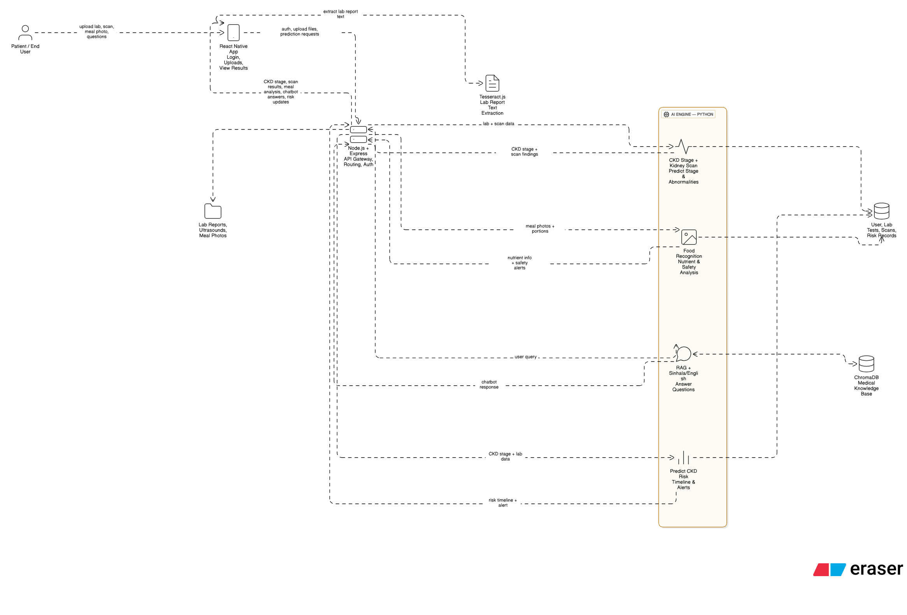

# Nephro-AI – CKD Management System

## Project Overview
Nephro-AI is a mobile AI-enabled platform designed to support the management of Chronic Kidney Disease (CKD). The system assists in early detection, dietary management, and continuous monitoring of CKD through an interactive mobile application.
The platform addresses key healthcare challenges such as delayed diagnosis, limited access to specialists, complex dietary requirements, language barriers, and high treatment costs.Nephro-AI provides the following capabilities:

- Early CKD risk prediction using machine learning techniques  
- AI-based diagnostics including lab report analysis, CKD stage determination, and ultrasound scan assessment  
- Real-time local dietary management using YOLO-based meal detection and CKD stage based safety check 
- 24/7 bilingual(English & Sinhala) medical support in English and Sinhala  
- Continuous monitoring of kidney function and disease progression  

Developed using React Native, Node.js, MongoDB, and Python-based AI models, Nephro-AI is a culturally adapted, affordable, and scalable solution aimed at improving access to quality kidney care in under-served communities.

---

## System Architecture Diagram

##  System Architecture

**Description:**  
This diagram illustrates the interaction between the mobile application, backend server, AI engine, and databases used for CKD monitoring and management.

## Technology Stack

### Frontend
- React Native

### Backend
- Node.js
- Express.js

### AI / ML
- Python
- TensorFlow / Keras
- YOLO (Meal Plate Analysis)

### Databases
- MongoDB
- ChromaDB (for chatbot knowledge retrieval)
